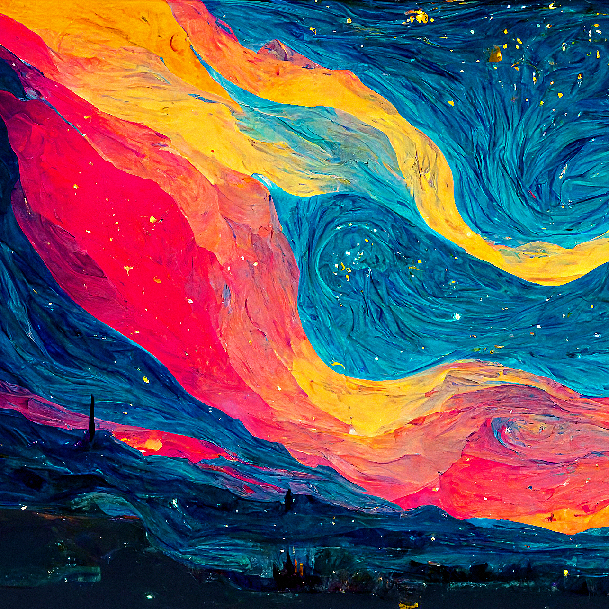
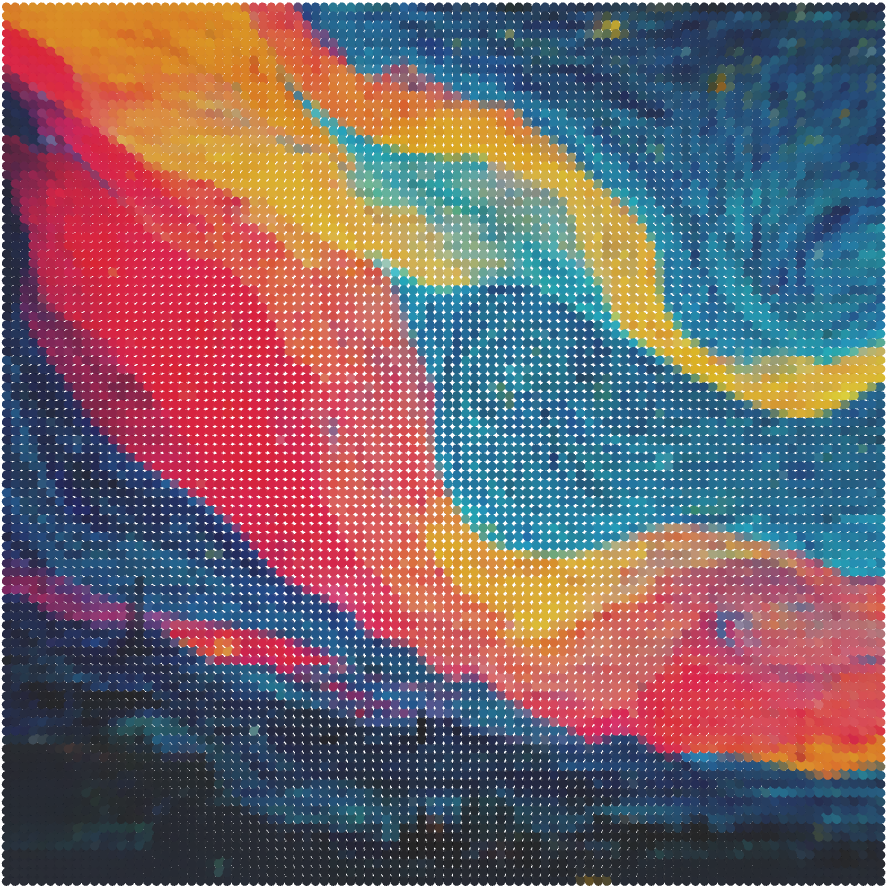
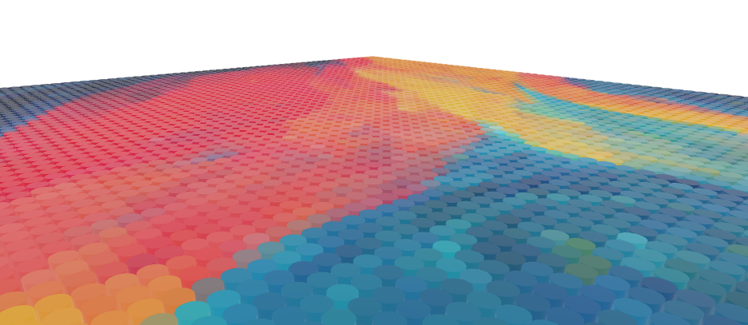
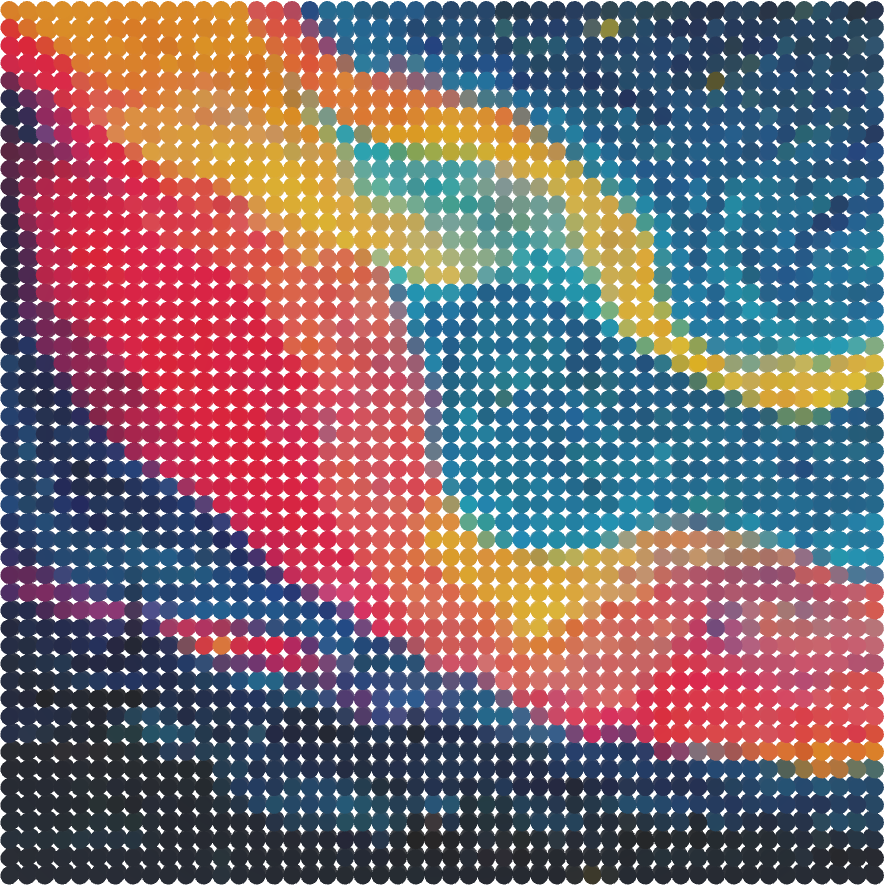

# Image to Lego converter

This project converts an image into a 3D Lego representation using Three.js. First, the image is pixelated and each resulting pixel's color is defined by the average color of the corresponding area in the original image. Then, the pixelated image is converted into Lego tiles, which are displayed in a Three.js scene.

It is possible to change the pixelation level, which affects the number of Lego tiles used in the final representation. The project also includes a basic user interface for interaction.

## Features

- Pixelate an image
- Convert pixelated image to Lego tiles
- Display the resulting geometry in a Three.js scene

## Requirements

- [Node.js](https://nodejs.org/) (for development)
- [npm](https://www.npmjs.com/) (for package management)

## Libraries Used

- [Three.js](https://threejs.org/) for 3D rendering
- [npx](https://www.npmjs.com/package/npx) for running the development server
- [Vite](https://vitejs.dev/) for fast development and build tooling

## Run the Project

1. Clone the repository: ```git clone https://github.com/Melvin-Menanteau/ImageLegoConverter3D.git```
2. Navigate to the project directory: ```cd ImageLegoConverter3D```
3. Install the dependencies: ```npm install```
4. Start the development server: ```npx vite```

## Example

### Input picture[^artist]



### Resulting Lego representation



----



### Resulting Lego representation using a different pixelation level



## Roadmap

### Essential Features

- [ ] Interface to define the pixelation level
- [ ] Use only Lego official round tile colors
- [ ] Add a button to upload an image
- [ ] Add a button to download the resulting image

### Nice-to-Have Features

- [ ] Create a frame around the resulting image (made of bricks)
- [ ] Check if the result fits in one of the Lego standard baseplates
- [ ] Cost estimation
- [ ] Use CIELAB color space for better color matching

[^artist]:
    The image used in the examples has been generated by [BasicAppleGuy](https://basicappleguy.com/basicappleblog/bigstarrysur)